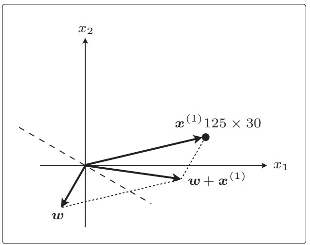

### 3.2 内积
$$
\large \boldsymbol w \cdot \boldsymbol x = \sum_{i=1}^nw_ix_i
$$
其中$\boldsymbol w$为权重向量。找到令$\boldsymbol w \cdot \boldsymbol x$为0的权重向量，也就是$\boldsymbol w$ 为法线。

内积是衡量向量间相似度的指标，若为正两者相似，若为0两者垂直，否则不相似。

### 3.3感知机
![[Pasted image 20230608122239.png]]
定义判别函数$f_w(\boldsymbol x)$：
$$
\large
\begin{equation}
f_{\boldsymbol w}(\boldsymbol x) = 
\begin{cases}
1 && (\boldsymbol w \cdot \boldsymbol x \ge 0)\\
-1 && (\boldsymbol w \cdot \boldsymbol x < 0)
\end{cases}
\end{equation}
$$
定义权重向量更新表达式：
$$
\large
\begin{equation} 
\boldsymbol w:=
\begin{cases}
\boldsymbol w+y^{(i)} \boldsymbol x^{(i)} && (f_{\boldsymbol w}(\boldsymbol 
x^{i}) \neq y^{(i)}) \\
\boldsymbol w && (f_{\boldsymbol w}(\boldsymbol x^{i}) = y^{(i)})
\end{cases} 
\end{equation} 
$$
当分类成功时，$\boldsymbol  w$不更新。当分类失败时，进行向量加法，相当于将权重向量向着参数向量的方向进行旋转。

### 3.4 线性可分

感知机只能用于线性可分的场景。

### 3.5 逻辑回归

#### 3.5.1 sigmoid函数
$$
\large f_\theta(\boldsymbol x) = \frac{1}{1+e^{(-\boldsymbol \theta ^T \boldsymbol x)}}
$$
![[sigmoid.jpg]]
##### 3.5.2 决策边界

记$P(y=1| \boldsymbol x) = f_\theta (\boldsymbol x)$。如果将sigmoid函数视为概率分布函数，以$f_\theta (\boldsymbol x)=0.5$为阈值（即$\boldsymbol \theta ^T \boldsymbol x=0$），小于0.5时$y=0$，否则$y=1$，定义决策函数
$$
\large 
\begin{equation} 
y = 
\begin{cases} 
1 && (\boldsymbol \theta ^T \boldsymbol x \ge 0) \\
0 && (\boldsymbol \theta ^T \boldsymbol x < 0)
\end{cases} 
\end{equation} 
$$
$\boldsymbol \theta ^T \boldsymbol x = 0$的直线就是决策边界。

### 3.6 似然函数

所有数据的联合概率，也就是似然函数：
$$
\large
L(\theta) = \prod_{i=1}^n P(y^{(i)}=1|\boldsymbol x^{(i)})^{y^{(i)}} P(y^{(i)}=0|\boldsymbol x^{(i)})^{1-y^{(i)}}
$$
求参数$\theta$使得目标函数$L(\theta)$最大，也就是将每一个输入数据$\boldsymbol x^{(i)}$判断正确的概率相乘的结果最大化。

### 3.7 对数似然函数
$$
\large
\begin{equation}
\begin{split}
log L(\theta) &= log\prod_{i=1}^n P(y^{(i)}=1|\boldsymbol x^{(i)})^{y^{(i)}} P(y^{(i)}=0|\boldsymbol x^{(i)})^{1-y^{(i)}} \\
& = \sum_{i=1}^n(logP(y^{(i)}=1|\boldsymbol x^{(i)})^{y^{(i)}} +logP(y^{(i)}=0|\boldsymbol x^{(i)})^{1-y^{(i)}}) \\
& = \sum_{i=1}^n({y^{(i)}}logP(y^{(i)}=1|\boldsymbol x^{(i)})+(1-y^{(i)})logP(y^{(i)}=0|\boldsymbol x^{(i)})) \\
& = \sum_{i=1}^n({y^{(i)}}logf_\theta(\boldsymbol x^{(i)}) +(1-y^{(i)})log(1-f_\theta(\boldsymbol x^{(i)})))
\end{split}
\end{equation} 
$$
对似然函数求微分
$$
\large 
\frac{\partial logL(\theta)}{\partial \theta_j} = \frac{\partial}{\partial \theta_j}\sum_{i=1}^n({y^{(i)}}logf_\theta(\boldsymbol x^{(i)}) +(1-y^{(i)})log(1-f_\theta(\boldsymbol x^{(i)})))
$$
令$u = logL(\boldsymbol \theta)，v = f_\theta(\boldsymbol x)$，$z=\boldsymbol \theta^T \boldsymbol x$
$$
\large
\frac{\partial logL(\theta)}{\partial \theta_j} = \frac{\partial u}{\partial \theta_j} = \frac{\partial u}{\partial v} \cdot \frac{\partial v}{\partial \theta _j}
$$
其中：
$$
\large 
\begin{equation}
\begin{split} 
\frac{\partial u}{\partial v} &= \frac{\partial}{\partial v}\sum_{i=1}^n({y^{(i)}}log(v) +(1-y^{(i)})log(1-v)) \\
&= \sum_{i=1}^n(\frac{y^{(i)}}{v}-\frac{1-y^{(i)}}{1-v})
\end{split} 
\end{equation} 
$$
$$
\large 
\begin{equation} 
\begin{split} 
\frac{\partial v}{\partial \theta_j} &= \frac{\partial}{\partial \theta_j}\frac{1}{1+e^{(-\boldsymbol \theta ^T \boldsymbol x)}} \\
&= \frac{\partial v}{\partial z} \cdot \frac{\partial z}{\partial \theta_j}
\end{split} 
\end{equation} 
$$
$$
\large
\frac{\partial v}{\partial z}=v(1-v)
$$

$$
\large 
\begin{equation} 
\begin{split} 
\frac{\partial z}{\partial \theta_j} &= \frac{\partial}{\partial \theta_j} \boldsymbol \theta^T \boldsymbol x \\
&=\frac{\partial}{\partial \theta_j}(\theta_0x_0+...+\theta_nx_n) \\
&=x_j
\end{split} 
\end{equation} 
$$
最终：
$$
\large
\begin{equation} 
\begin{split} 
\frac{\partial u}{\partial \theta_j} &= \frac{\partial u}{\partial v} \cdot \frac{\partial v}{\partial z} \cdot \frac{\partial z}{\partial \theta_j} \\
&= \sum_{i=1}^{n}(y^{(i)}-f_\theta(\boldsymbol x^{(i)}))x_j^{(i)}
\end{split} 
\end{equation} 
$$

### 3.8 线性不可分

