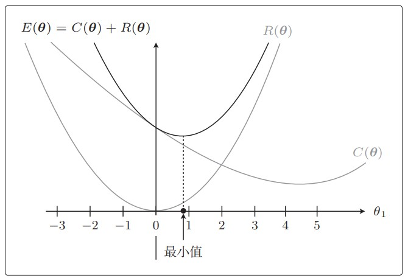

4.1 模型评估
测量预测函数$f_\theta(\boldsymbol x)$的正确性。

4.2 交叉验证
回归问题验证
一份数据用于测试，一份数据用于验证。
均方差(MSE)
$$
\large
\frac{1}{n}\sum_{i=1}^n(y^{(i)}-f_\theta(\boldsymbol x^{(i)}))^2
$$
分类问题验证
精确率与召回率
精确率
$$
Precision=\frac{TP}{TP+FP}
$$
召回率
$$
Recall = \frac{TP}{TP+FN}
$$

4.2.4 F值

4.3 正则化

4.3.1 过拟合

解决方法
+ 增加训练数据量。
+ 使用简单的模型。
+ 正则化。

4.3.2 正则化的方法
添加惩罚项$R(\theta)$

$$
\large
\displaystyle 
\begin{equation}
\begin{split}
E(\theta) &= \frac{1}{2} \sum_{i=1}^n(y^{(i)}-f_{\theta}(x^{(i)}))^2 + R(\theta ) \\
&= \frac{1}{2} \sum_{i=1}^n(y^{(i)}-f_{\theta}(x^{(i)}))^2 + \frac{\lambda}{2} \sum_{j=1}^m \theta_j^2
\end{split}
\end{equation}
$$
一般不对偏置项$\theta_0$做正则化。

4.3.3 正则化的效果

防止参数变得过大导致对结果的影响过大。

4.3.4 分类的正则化

在对数似然函数后添加惩罚项

$$
\large
log L(\theta) = -\sum_{i=1}^n({y^{(i)}}logf_\theta(\boldsymbol x^{(i)}) +(1-y^{(i)})log(1-f_\theta(\boldsymbol x^{(i)}))) + \frac{\lambda}{2}\sum_{j=1}^m \theta_j^2
$$

4.3.5 包含正则化项的表达式微分
回归问题
$$
\large
\frac{\partial E(\theta)}{\partial \theta_j} = \frac{\partial C(\boldsymbol \theta)}{\partial \theta_j} + \frac{\partial R(\boldsymbol \theta)}{\partial \theta_j}
$$
其中：
$$
\large
\frac{\partial C(\theta)}{\partial \theta_j} = \sum_{i=1}^{n}(y^{(i)}-f_\theta(\boldsymbol x^{(i)}))x_j^{(i)}
$$
$$
\large 
\frac{\partial R(\theta)}{\partial \theta_j} = \lambda \theta_j
$$
最终：
$$
\large
\frac{\partial E(\theta)}{\partial \theta_j} = \sum_{i=1}^{n}(y^{(i)}-f_\theta(\boldsymbol x^{(i)}))x_j^{(i)} + \lambda \theta_j
$$
因此更新表达式为：
$$
\large
\theta_j := \theta_j - \eta(\sum_{i=1}^n(f \theta(\boldsymbol x^{(i)})-y^{(i)})x_j^{(i)}+\lambda \theta_j)
$$
逻辑回归

L1/L2正则化
L2正则化的惩罚项
$$
\large
R(\boldsymbol \theta) = \frac{\lambda}{2}\sum_{j=1}^m \theta_j^2
$$
L1正则化的惩罚项
$$
\large
R(\boldsymbol \theta) = \lambda \sum_{i=1}^m|\theta_i|
$$
L1正则化项会将不需要的参数变为0从而减少变量的个数。L2正则化抑制参数，L1正则化直接去除不要的变量。

## 学习曲线

### 4.4.1 欠拟合

4.4.2 区分过拟合与欠拟合

欠拟合学习曲线

![[accuracy.jpg]]

过拟合学习曲线

![[overfitting.jpg]]